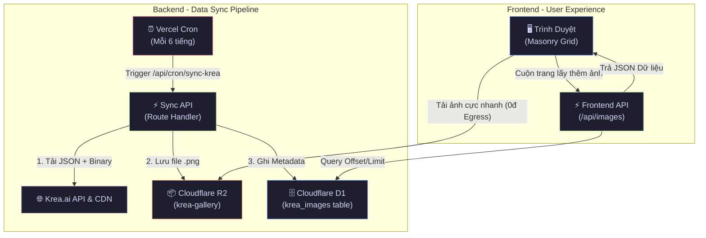

# Krea.ai Infinity Gallery - R2 & D1 Architecture

Tài liệu thiết kế hệ thống và định hướng kỹ thuật cho dự án **Krea.ai Infinity Gallery** - Ứng dụng hiển thị thư viện ảnh quy mô lớn (>10.000 ảnh) tự động cào từ Krea.ai. Phiên bản này đã được nâng cấp lên kiến trúc **Cloudflare R2 + D1**, mang lại hiệu năng cao và đặc biệt là **chi phí băng thông (Egress) 0 đồng**.

---

## 1. Công Nghệ Sử Dụng (Tech Stack)

| Thành phần | Công nghệ | Mục đích |
| :--- | :--- | :--- |
| **Framework** | Next.js 16 (App Router) + TypeScript | Khung ứng dụng chính, API route handlers, Serverless. |
| **Database** | Cloudflare D1 (SQLite ở Edge) | Lưu trữ siêu tốc metadata của hàng vạn bức ảnh (ID, URL, prompt, màu sắc). |
| **Storage** | Cloudflare R2 (S3-compatible) | Lưu trữ file ảnh vật lý (`.png`), miễn phí hoàn toàn băng thông tải ra (Egress). |
| **Styling** | Vanilla CSS + Tailwind | Tối ưu hiệu năng render, hiệu ứng Glassmorphism & Animations. |
| **Frontend Grid** | CSS Virtual Rendering | Kỹ thuật `content-visibility: auto` giúp cuộn mượt mà không quá tải RAM. |
| **Automation** | Vercel Cron Jobs | Tự động kích hoạt luồng cào ảnh ngầm định kỳ mỗi 6 tiếng. |

---

## 2. Kiến Trúc Hệ Thống (Cloudflare Zero-Egress)

Hệ thống được thiết kế hoàn toàn tự chủ, giải quyết triệt để vấn đề phụ thuộc vào CDN của Krea và nguy cơ mất ảnh nếu Krea xóa dữ liệu gốc.



### Tại sao chọn R2 + D1?
- **Chi phí cực thấp:** R2 miễn phí hoàn toàn Egress bandwidth (rất quan trọng với ứng dụng Gallery). Gói miễn phí cho 10GB lưu trữ và hàng chục triệu request.
- **Tốc độ (Edge):** D1 là cơ sở dữ liệu SQLite nằm ở rìa mạng lưới Cloudflare, giúp tốc độ phản hồi API phân trang (`/api/images`) chỉ mất vài chục mili-giây.

---

## 3. Quản Lý & Nạp Dữ Liệu (Scraping & Seeding)

Dự án sở hữu 2 cơ chế nạp dữ liệu từ Krea.ai:

### 3.1. Cào tự động (Cron Job)
- **Tập tin:** `app/api/cron/sync-krea/route.ts`
- **Mô tả:** Chạy tự động bởi Vercel mỗi 6 giờ. Giới hạn thời gian chạy dưới 50s để phù hợp với quy định Serverless Hobby (cào khoảng 120 ảnh/lần).
- **Bảo mật:** Sử dụng `Authorization: Bearer <CRON_SECRET>`.
- **Cấu hình lịch:** Có thể tùy chỉnh hoặc tắt hẳn trong file `vercel.json`.

### 3.2. Cào tốc độ cao số lượng lớn (Local Seed Script)
- **Tập tin:** `app/api/seed/route.ts` (Thường để tạm thời, không commit file này nếu lo ngại bảo mật trên production).
- **Mô tả:** Được thiết kế để cào hàng ngàn ảnh (1000 - 2000 ảnh) trong một lần chạy mà không bị ngắt quãng.
- **Cách sử dụng tốt nhất:** 
  Vì D1 và R2 đều nằm trên Cloud, nên bạn có thể chạy `npm run dev` ở máy tính cá nhân (localhost) và trigger script này. Việc chạy trên máy nhà giúp **vượt qua giới hạn 60s timeout của Vercel**, dữ liệu vẫn đổ thẳng lên Cloudflare cho bản web sử dụng.

---

## 4. Chống Lặp Lại Dữ Liệu (Duplicate Prevention)

Hệ thống sở hữu 3 lớp bảo vệ chống lặp ảnh nghiêm ngặt:
1. **Frontend (Set UI):** Sử dụng `useRef<Set<string>>` trong React để gạt bỏ ngay lập tức những ID ảnh đã hiển thị trên màn hình, tránh lặp khi API bị dịch chuyển offset.
2. **Backend (Scraper):** Truy vấn `SELECT id FROM krea_images WHERE krea_id = ?` trước khi tốn băng thông tải file về R2.
3. **Database (Schema):** Cột `krea_id` được khóa cứng bằng thuộc tính `UNIQUE NOT NULL` ở mức cơ sở dữ liệu.

---

## 5. Cấu Trúc Database (Cloudflare D1)

Bảng `krea_images`:
```sql
CREATE TABLE krea_images (
  id INTEGER PRIMARY KEY AUTOINCREMENT,
  krea_id TEXT UNIQUE NOT NULL,      -- ID gốc của Krea để chống trùng
  image_url TEXT NOT NULL,           -- URL R2 Public (đã rút gọn)
  krea_url TEXT NOT NULL,            -- URL gốc (backup)
  prompt TEXT,                       -- Lời nhắc AI tạo ảnh
  width INTEGER,                     
  height INTEGER,
  color TEXT,                        -- Màu chủ đạo (Dominant color) dùng làm nền tải
  synced_at DATETIME DEFAULT CURRENT_TIMESTAMP
);
CREATE INDEX idx_synced_at ON krea_images(synced_at DESC);
```

---

## 6. Hướng Dẫn Cài Đặt (Setup Instructions)

Yêu cầu 9 biến môi trường thiết yếu trong file `.env`:

```bash
# 1. Krea Cookie (Để vượt rào cào ảnh)
KREA_SESSION_COOKIE="krea-canary=never; ..."

# 2. R2 Configuration
R2_ACCOUNT_ID="your_account_id"
R2_ACCESS_KEY_ID="your_r2_access_key"
R2_SECRET_ACCESS_KEY="your_r2_secret_key"
R2_BUCKET_NAME="krea-gallery"
R2_PUBLIC_URL="https://pub-xyz.r2.dev"

# 3. D1 Configuration
D1_ACCOUNT_ID="your_account_id"
D1_DATABASE_ID="your_db_uuid"
D1_API_TOKEN="your_cf_api_token"

# 4. Security
CRON_SECRET="your-secure-random-string"
```

> ⚠️ **Lưu ý Deploy:** Khi đẩy code lên Vercel, hãy đảm bảo bạn sao chép toàn bộ 9 biến môi trường này vào mục **Settings > Environment Variables** của dự án trên Vercel.