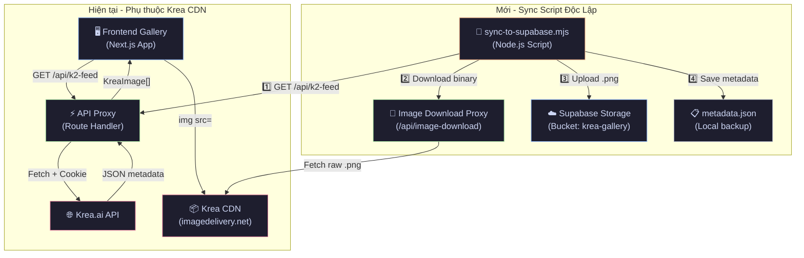
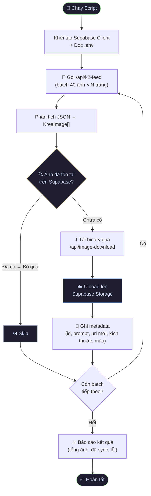

# Krea.ai Infinity Gallery - Technical & Design Specification

Tài liệu thiết kế hệ thống và định hướng kỹ thuật cho dự án **Krea.ai Infinity Gallery** - Ứng dụng hiển thị thư viện ảnh quy mô lớn (>10.000 ảnh) từ Krea.ai, được xây dựng trên nền tảng **Next.js (App Router)** kết hợp với kiến trúc Serverless/Edge Caching tiên tiến.

---

## 1. Công Nghệ Sử Dụng (Tech Stack)

| Thành phần | Công nghệ | Mục đích |
| :--- | :--- | :--- |
| **Framework** | Next.js 16 (App Router) + TypeScript | Khung ứng dụng chính, quản lý state, SSR/ISR và tối ưu hóa hình ảnh |
| **Styling** | Vanilla CSS | Tối ưu hiệu năng render, tùy biến hiệu ứng Glassmorphism & Animations |
| **Smooth Scroll** | Lenis (by Studio Freight) | Tạo độ trượt quán tính (momentum scroll) mượt mà cho toàn trang |
| **Infinite Scroll** | `IntersectionObserver` Native | Bắt sự kiện cuộn phần cứng, kết hợp tải đa luồng động (Incremental Parallel Fetching) |
| **API Proxy** | Next.js Route Handlers (Edge/Serverless) | Che giấu session cookie, bypass CORS và cấu hình Cache-Control tĩnh/động |
| **Deployment** | Vercel | Hosting, Vercel Edge Network và tích hợp CI/CD tự động |

---

## 2. Hệ Thống Thiết Kế (Design System)

Ứng dụng hướng tới trải nghiệm thị giác cao cấp (Premium UI/UX) lấy cảm hứng từ các trang web thiết kế nghệ thuật đương đại:

### 2.1. Bảng Màu & Typography (Theme & Fonts)
*   **Theme:** Deep Dark Mode.
    *   Màu nền chính: `#09090b` (Zinc 950)
    *   Màu nền thẻ/modal: `#18181b` (Zinc 900) với viền `#27272a` (Zinc 800)
    *   Màu chữ: `#ffffff` (Primary) và `#a1a1aa` (Muted Zinc 400)
*   **Typography:** Google Fonts.
    *   Tiêu đề chính: `Outfit` (đậm, tracking-tight, hiện đại)
    *   Nội dung & Prompt: `Inter` (rõ ràng, dễ đọc ở kích thước nhỏ)

### 2.2. Lưới Ảnh Tự Do (Responsive Masonry Grid)
*   Sử dụng thủ thuật chia `KreaImage[][]` động dựa trên kích thước màn hình và render theo dạng cột Flexbox.
*   Hiệu ứng Loading: Loại bỏ Shimmer giả tạo, thay bằng cơ chế **Dominant Color Placeholder** (lấy mã màu chủ đạo của ảnh làm nền) giống Pinterest.
*   **Virtual Rendering:** Tối ưu hóa DOM thông qua CSS `content-visibility: auto` và `contain-intrinsic-size` để trình duyệt bỏ qua việc render các thẻ ẩn ngoài màn hình.

### 2.3. Tương Tác & Hiệu Ứng (Micro-animations)
*   **Card Hover:** Phóng to nhẹ (`scale-[1.03]`), hiển thị toàn văn Prompt.
*   **Modal/Popup:** Nền mờ kính (`backdrop-filter: blur(12px)`) kết hợp với nút bấm tinh tế.
*   **Download:** Trực tiếp chuyển URL thành Blob và kích hoạt tải xuống, vượt qua rào cản CORS của trình duyệt.

---

## 3. Kiến Trúc Hiệu Năng Cao (High-Performance Architecture)

Để đảm bảo việc cuộn hàng vạn tấm ảnh không gây nghẽn trình duyệt hay quá tải API, dự án đã áp dụng cấu trúc tối ưu ở 3 cấp độ:

### Tầng 1: DOM & CSS Optimization
*   Sử dụng CSS `content-visibility: auto` để giải phóng GPU/CPU khỏi các node DOM không nằm trong Viewport.
*   Sử dụng Next.js `<Image>` với thuộc tính `sizes` chuẩn xác: `sizes="(max-width: 640px) 50vw, (max-width: 1024px) 33vw, 25vw"`.

### Tầng 2: React State & JavaScript
*   Triệt tiêu các Re-renders thừa thãi bằng `useMemo` hai tầng (lọc tìm kiếm và phân rã cột).
*   Đồng bộ hóa vòng lặp Scroll của Lenis và `requestAnimationFrame` để xử lý mượt mà sự kiện cập nhật giao diện.
*   **Cơ chế Incremental Fetching:** Khởi động bằng 1 Batch (40 ảnh), tăng tiến lên 2, 3 và giới hạn ở 4 Batch song song. Áp dụng Streaming State Update (nạp ảnh vào DOM ngay lập tức từng chùm thay vì đợi toàn bộ `Promise.all` kết thúc).

### Tầng 3: Edge Caching & API Strategy
*   **Vercel Edge Cache:** Route Handler (`app/api/k2-feed/route.ts`) được tích hợp `Cache-Control: s-maxage=60, stale-while-revalidate=300`. Nếu không có Cookie cá nhân, Vercel Edge Network sẽ tự động lưu Cache và trả dữ liệu trong chưa tới 5ms (Cache Hit).
*   **Silent Prefetch:** Khi người dùng chạm ngưỡng 2500px cách đáy trang, ứng dụng sẽ tải ngầm Batch tiếp theo mà không làm giật khung hình hay hiện Loading Bar.
*   **AbortController Timeout:** Chặn đứng các Request treo quá 8 giây (trả về 504) để tránh tràn bộ nhớ Serverless Function.

---

## 4. Đặc Tả Dữ Liệu & API

### 4.1. Cấu Trúc Khối Dữ Liệu Ảnh (`KreaImage` Interface)
```typescript
interface KreaImage {
  id: string;                    // UUID định danh ảnh
  image_url: string;             // Đường dẫn URL CDN của ảnh (.png)
  prompt?: string;               // Câu lệnh prompt dùng để generate
  width?: number;                // Chiều rộng
  height?: number;               // Chiều cao
  color?: string;                // Mã màu chủ đạo (Dominant color) dùng làm nền
}
```

### 4.2. Luồng Gọi API Proxy
*   Ứng dụng Frontend gọi tới endpoint nội bộ: `/api/k2-feed?itemOffset=X&limit=Y`
*   Route Handler (`app/api/k2-feed/route.ts`) tiếp nhận yêu cầu, phân tích biến môi trường `KREA_SESSION_COOKIE`:
    *   **Nếu có Cookie:** Tắt hoàn toàn Caching (`no-store`), giả lập User-Agent, gửi lệnh cào dữ liệu cho Krea.ai (áp dụng cho Feed Cá nhân/Private).
    *   **Nếu không có Cookie:** Bật Vercel Edge Cache (`s-maxage=60`), phản hồi siêu tốc cho toàn bộ Public Users.

---

## 5. Hạn Chế & Hướng Giải Quyết (Limitations & Solutions)

> [!WARNING]
> **Hạn chế của giải pháp Scraping trực tiếp:**
> 1. **Rủi ro API nội bộ:** API `/api/k2-feed` của Krea có thể thay đổi cấu trúc dữ liệu JSON bất cứ lúc nào, khiến frontend bị lỗi phân tích cú pháp.
> 2. **Ràng buộc Điều khoản (TOS):** Việc phân phối ứng dụng cào dữ liệu công khai hoặc đẩy số lượng Request cực lớn (>100.000 req/min) có thể dẫn tới rủi ro bị khóa IP theo điều khoản của nhà cung cấp.
> 3. **Phụ thuộc CDN bên thứ 3:** Toàn bộ hình ảnh đang được serve trực tiếp từ CDN của Krea (`imagedelivery.net` / `storage.googleapis.com`). Nếu Krea thay đổi chính sách CDN hoặc xóa ảnh, gallery sẽ mất dữ liệu vĩnh viễn.

### Giải pháp: Supabase Storage Sync (Lưu trữ ảnh độc lập)

Để loại bỏ sự phụ thuộc vào CDN của Krea, hệ thống áp dụng kiến trúc **Storage Sync** — đồng bộ toàn bộ ảnh và metadata sang **Supabase Storage** (Object Storage tương tự Firebase Storage / Cloudflare R2).

#### 5.1. Tại sao chọn Supabase Storage?

| Tiêu chí | **Supabase Storage** | Cloudflare R2 | Firebase Storage |
| :--- | :--- | :--- | :--- |
| **Tích hợp sẵn** | ✅ Đã có Auth trong project | ❌ Setup mới | ❌ Setup mới |
| **Free Tier** | 1GB storage, 2GB bandwidth | 10GB, free egress | 5GB, 1GB/ngày |
| **Chi phí/GB** | $0.021 | $0.015 | $0.026 |
| **Egress** | $0.09/GB | **$0 miễn phí** | $0.12/GB |
| **CDN toàn cầu** | ✅ Supabase CDN | ✅ Cloudflare | ✅ Google CDN |
| **S3-compatible** | ✅ | ✅ | ❌ |
| **Database cùng hệ sinh thái** | ✅ PostgreSQL tích hợp | ❌ | ❌ |

> [!NOTE]
> **Supabase Storage** được chọn vì project đã sử dụng Supabase Auth (`sb-superb-auth-token`). Việc thêm Storage Bucket không cần tạo tài khoản mới, đồng thời mở đường cho việc tích hợp Supabase PostgreSQL (lưu metadata) trong tương lai.

#### 5.2. Kiến Trúc Tổng Quan (High-Level Architecture)



#### 5.3. Luồng Xử Lý Chi Tiết (Detailed Sync Pipeline)



#### 5.4. Cấu Hình Môi Trường

Thêm các biến sau vào file `.env`:

```bash
# Supabase Storage Configuration
# Lấy từ: Supabase Dashboard → Settings → API
SUPABASE_URL=https://<project-id>.supabase.co
SUPABASE_SERVICE_KEY=eyJ...  # service_role key (KHÔNG phải anon key)
SUPABASE_BUCKET=krea-gallery  # Tên bucket (cần tạo trước trên Dashboard)
```

> [!IMPORTANT]
> **Chuẩn bị trên Supabase Dashboard:**
> 1. Vào **Storage** → **New Bucket** → Tên: `krea-gallery`, chọn **Public**
> 2. Vào **Settings → API** → Copy `Project URL` và `service_role` key
> 3. Dán vào file `.env` như trên

#### 5.5. Sử Dụng Script Sync

```bash
# 1. Đảm bảo dev server đang chạy (script gọi API proxy qua localhost)
npm run dev

# 2. Chạy sync (trong terminal khác)
node scripts/sync-to-supabase.mjs

# 3. Tuỳ chọn: Giới hạn số lượng ảnh sync
node scripts/sync-to-supabase.mjs --limit 500

# 4. Tuỳ chọn: Chạy tự động định kỳ (cron mỗi 6 tiếng)
# crontab: 0 */6 * * * cd /path/to/project && node scripts/sync-to-supabase.mjs
```

#### 5.6. Cấu Trúc Dữ Liệu Sau Sync

```
Supabase Storage (Bucket: krea-gallery)
├── images/
│   ├── <uuid-1>.png          ← Ảnh gốc full-resolution
│   ├── <uuid-2>.png
│   └── ...
└── (metadata lưu trong metadata.json hoặc Supabase PostgreSQL)

URL công khai:
https://<project>.supabase.co/storage/v1/object/public/krea-gallery/images/<uuid>.png
```

> [!TIP]
> **Mở rộng trong tương lai:** Khi đã có ảnh trên Supabase Storage, có thể chuyển Frontend sang đọc từ Supabase CDN thay vì Krea CDN. Chỉ cần thay `image_url` trong response của API proxy — **không cần sửa bất kỳ component nào trên Frontend**.

---

## 6. Phân tích Các Đoạn Code Quan Trọng (Code Deep Dive)

Dưới đây là giải thích chi tiết về các kỹ thuật tối ưu hóa cốt lõi đã được áp dụng để mang lại hiệu năng cao nhất cho dự án:

### 6.1. CSS Virtual Rendering (Tối ưu DOM)
**Vấn đề:** Khi render hàng ngàn tấm ảnh, trình duyệt sẽ bị quá tải bộ nhớ và tụt FPS trầm trọng.
**Giải pháp:** Kỹ thuật Virtualization bằng CSS thuần túy, ép trình duyệt không tính toán layout hay paint các phần tử chưa lọt vào màn hình.
```css
/* app/globals.css */
.image-card-wrapper {
  /* Bỏ qua tính toán layout và paint cho các thẻ nằm ngoài viewport */
  content-visibility: auto;
  /* Kích thước nội tại giả định để thanh cuộn (scrollbar) không bị giật/nhảy */
  contain-intrinsic-size: 0 420px;
}
```

### 6.2. Incremental Parallel Fetching (Tải đa luồng động)
**Vấn đề:** Tải tuần tự từng chùm 40 ảnh sẽ làm người dùng cuộn nhanh bị hẫng. Ngược lại, nếu tải luôn 200 ảnh một lúc sẽ gây nghẽn mạng và bị API đánh dấu rác (rate-limit).
**Giải pháp:** Khởi động mồi bằng 1 luồng (40 ảnh). Khi người dùng cuộn sâu hơn, hệ thống dự đoán nhu cầu và tự động tăng số luồng song song lên 2, 3 và kịch trần là 4 luồng (160 ảnh/lần cuộn).
```tsx
// app/page.tsx
const handleIntersect = useCallback((entries) => {
  if (entries[0].isIntersecting && hasMoreRef.current && !loadingRef.current) {
    // Kích hoạt N luồng API gọi song song cùng lúc
    fetchMultipleBatches(offsetRef.current, batchMultiplierRef.current);

    // Tăng dần số luồng (scale up) cho những lần cuộn tiếp theo
    if (batchMultiplierRef.current < 4) {
      batchMultiplierRef.current += 1;
    }
  }
}, []);
```

### 6.3. Streaming State Update & Silent Prefetch
**Vấn đề:** Nếu dùng `Promise.all` cho 4 luồng song song, giao diện sẽ đóng băng cho đến khi luồng chậm nhất tải xong.
**Giải pháp:** Luồng nào tải xong thì đẩy chèn luôn ảnh của luồng đó vào màn hình ngay lập tức (Streaming). Sau đó, kích hoạt hệ thống tải ngầm định (Silent Prefetch) chuẩn bị sẵn lứa ảnh tiếp theo khi người dùng vẫn còn cách đáy 2500px.
```tsx
// app/page.tsx
// Lặp qua từng luồng, luồng nào xong thì cập nhật State ngay lập tức
const promises = Array.from({ length: currentCount }, (_, i) =>
  fetchBatch(startOffset + i * limit).then((newImages) => {
    const uniqueNew = newImages.filter(img => { /* ...lọc trùng lặp bằng Set... */ });
    setImages(prev => [...prev, ...uniqueNew]); // Nạp thẳng vào UI không cần đợi luồng khác
  })
);
await Promise.all(promises); // Chờ xong tất cả chỉ để gỡ cờ Loading

// Tải ngầm lứa tiếp theo mà không khóa UI (Silent Prefetch)
if (lastBatchCount > limit / 2) prefetchNext(nextOffset);
```

### 6.4. Vercel Edge Caching & Timeout (Backend Proxy)
**Vấn đề:** Serverless Functions trên Vercel có thể bị treo (hang) vô thời hạn nếu API bên thứ 3 chậm, gây nghẽn RAM và dội chi phí. Ngoài ra, cần tối ưu thời gian phản hồi cho hàng ngàn người dùng chung một Feed.
**Giải pháp:** Giăng lưới AbortController đếm ngược 8 giây và rẽ nhánh chiến lược Caching ở Edge Network.
```ts
// app/api/k2-feed/route.ts
const controller = new AbortController();
// Ép hủy kết nối nếu quá 8 giây để tránh treo Serverless Function (timeout gốc là 10-15s)
timeout = setTimeout(() => controller.abort(), 8000);

// Chiến lược Cache thông minh
const cacheHeaders = cookie
  ? { 'Cache-Control': 'no-store' } // Dữ liệu cá nhân -> Tắt Cache hoàn toàn
  : { 'Cache-Control': 's-maxage=60, stale-while-revalidate=300' }; // Dữ liệu Public -> Caching ở biên CDN 60s
```