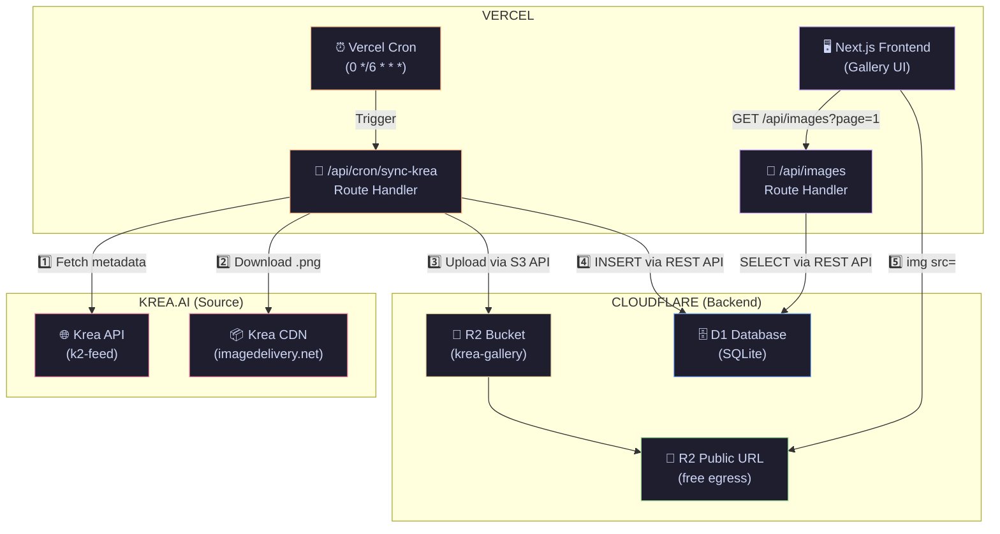
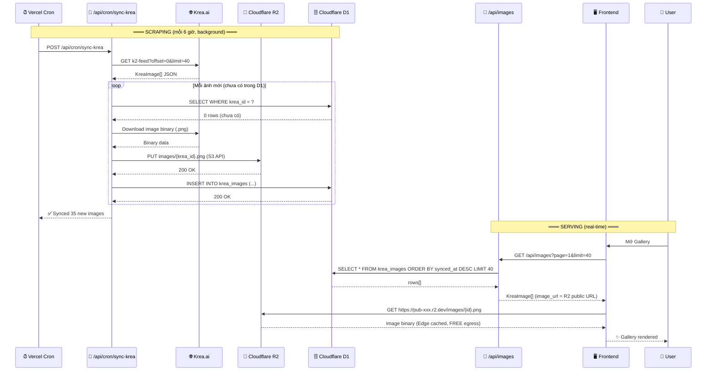

# Full-Stack Krea Gallery — Vercel + Cloudflare (R2 + D1)

> **Trạng thái:** 📋 Chưa triển khai — Tài liệu thiết kế kiến trúc (Implementation Blueprint)
> **Ngày tạo:** 2026-07-03
> **Mục đích:** Lưu trữ bản thiết kế full-stack để triển khai khi sẵn sàng

---

## Kiến Trúc Chọn

```
Vercel (Frontend + Cron) ←→ Cloudflare (R2 Storage + D1 Database)
```

| Layer | Công nghệ | Vai trò |
|:---|:---|:---|
| **Frontend** | Next.js 16 on Vercel | Gallery UI, SSR, infinite scroll |
| **Cron Scheduler** | Vercel Cron Jobs | Trigger scraper mỗi 6h |
| **Scraper** | Vercel Route Handler | Cào Krea → upload R2 → insert D1 |
| **Image Storage** | Cloudflare R2 | Lưu ảnh .png, **free egress** |
| **Metadata DB** | Cloudflare D1 (SQLite) | Prompt, kích thước, dominant color |
| **Image Serving** | R2 Public Bucket URL | CDN toàn cầu, zero egress cost |

> [!NOTE]
> **Tại sao Cloudflare R2 + D1 thay vì Supabase?**
> - R2 có **free egress bandwidth** — yếu tố quyết định cho gallery 10K+ ảnh
> - D1 là SQLite at edge — đơn giản, nhanh, free tier 5GB
> - R2 dùng **S3-compatible API** — dễ truy cập từ Vercel
> - D1 có **REST API** — query được từ bất kỳ đâu

---

## Kiến Trúc Tổng Quan



---

## Luồng Dữ Liệu Chi Tiết



---

## Cloudflare D1 Schema

```sql
-- Tạo trên Cloudflare Dashboard hoặc Wrangler CLI
CREATE TABLE krea_images (
    id          INTEGER PRIMARY KEY AUTOINCREMENT,
    krea_id     TEXT UNIQUE NOT NULL,             -- ID gốc từ Krea
    image_url   TEXT NOT NULL,                    -- R2 public URL
    krea_url    TEXT,                             -- URL gốc Krea CDN (backup ref)
    prompt      TEXT DEFAULT '',
    width       INTEGER,
    height      INTEGER,
    color       TEXT DEFAULT '#1a1a1a',           -- Dominant color placeholder
    synced_at   TEXT DEFAULT (datetime('now')),
    created_at  TEXT DEFAULT (datetime('now'))
);

-- Index cho pagination
CREATE INDEX idx_synced_at ON krea_images (synced_at DESC);
```

## R2 Bucket Structure

```
krea-gallery/                          ← R2 Bucket (Public Access)
├── images/
│   ├── abc123-def456.png              ← Full-res image (keyed by krea_id)
│   ├── ghi789-jkl012.png
│   └── ...
```

**Public URL format:**
```
https://pub-{hash}.r2.dev/images/{krea_id}.png
```
Hoặc custom domain: `https://gallery-cdn.yourdomain.com/images/{krea_id}.png`

---

## Proposed Changes

### Cloudflare Setup (Manual, one-time)

1. **R2 Bucket:** Dashboard → R2 → Create Bucket `krea-gallery` → Enable Public Access
2. **D1 Database:** Dashboard → D1 → Create Database `krea-gallery-db` → Run schema SQL
3. **API Token:** Dashboard → API Tokens → Create Token (R2 read/write + D1 read/write)
4. **R2 S3 Credentials:** R2 → Manage R2 API Tokens → Create (S3 Auth)

---

### Backend (Vercel Route Handlers)

#### [NEW] `lib/cloudflare.ts`
Cloudflare client helpers:
- `d1Query(sql, params)` — Query D1 via REST API
- `r2Upload(key, buffer, contentType)` — Upload to R2 via S3-compatible API (`@aws-sdk/client-s3`)
- `r2PublicUrl(key)` — Generate public URL for uploaded file

```typescript
// D1 REST API access pattern
const D1_API = `https://api.cloudflare.com/client/v4/accounts/${ACCOUNT_ID}/d1/database/${DB_ID}/query`;

// R2 S3-compatible access pattern
const R2_ENDPOINT = `https://${ACCOUNT_ID}.r2.cloudflarestorage.com`;
```

#### [NEW] `app/api/cron/sync-krea/route.ts`
Vercel Cron-triggered scraper:
- Verify `CRON_SECRET` header (Vercel sends this automatically)
- Fetch N batches from Krea API (reuse existing proxy logic)
- For each new image: download binary → upload R2 → insert D1
- Concurrency: 5 parallel uploads (p-limit pattern)
- Max runtime: 55s (Vercel Serverless limit = 60s)

#### [NEW] `app/api/images/route.ts`
Frontend-facing API (replaces `/api/k2-feed`):
- Query params: `?page=1&limit=40&search=cyberpunk`
- Query D1: `SELECT * FROM krea_images ORDER BY synced_at DESC LIMIT ? OFFSET ?`
- Response format: same `KreaImage[]` interface (drop-in replacement)
- Cache: `s-maxage=30, stale-while-revalidate=300`

---

### Frontend

#### [MODIFY] `app/page.tsx`
Minimal change — chỉ đổi endpoint trong `fetchBatch()`:
```diff
- `/api/k2-feed?itemOffset=${batchOffset}&limit=${limit}&sort=random&bangers=true&staffPicksFirstPage=true`
+ `/api/images?page=${Math.floor(batchOffset / limit) + 1}&limit=${limit}`
```

#### [MODIFY] `next.config.mjs`
Thêm R2 domain:
```diff
  remotePatterns: [
    { protocol: 'https', hostname: 'gen.krea.ai' },
    { protocol: 'https', hostname: 'images.weserv.nl' },
+   { protocol: 'https', hostname: 'pub-*.r2.dev' },
  ],
```

#### [MODIFY] `vercel.json`
Thêm cron + R2 domain:
```json
{
  "crons": [{ "path": "/api/cron/sync-krea", "schedule": "0 */6 * * *" }],
  "images": {
    "sizes": [640, 1080],
    "domains": ["gen.krea.ai", "pub-*.r2.dev"],
    "formats": ["image/avif", "image/webp"]
  }
}
```

---

### Environment Variables

#### [MODIFY] `.env` (local) + Vercel Dashboard (production)
```bash
# === Existing ===
KREA_SESSION_COOKIE="..."

# === NEW: Cloudflare R2 (S3-compatible) ===
R2_ACCOUNT_ID=your_cloudflare_account_id
R2_ACCESS_KEY_ID=your_r2_access_key
R2_SECRET_ACCESS_KEY=your_r2_secret_key
R2_BUCKET_NAME=krea-gallery
R2_PUBLIC_URL=https://pub-xxxx.r2.dev    # hoặc custom domain

# === NEW: Cloudflare D1 ===
D1_ACCOUNT_ID=your_cloudflare_account_id  # same as R2
D1_DATABASE_ID=your_d1_database_id
D1_API_TOKEN=your_cloudflare_api_token    # Bearer token

# === NEW: Cron Security ===
CRON_SECRET=your-random-secret-string
```

---

## Cấu Trúc Thư Mục Sau Triển Khai

```
app/
├── api/
│   ├── cron/
│   │   └── sync-krea/
│   │       └── route.ts          ← [NEW] Cron scraper → R2 + D1
│   ├── images/
│   │   └── route.ts              ← [NEW] Frontend API (reads D1)
│   ├── image-download/
│   │   └── route.ts              ← [GIỮ] Proxy download (for manual use)
│   ├── k2-feed/
│   │   └── route.ts              ← [GIỮ] Legacy fallback
│   └── k2-similar/
│       └── route.ts              ← [GIỮ]
├── globals.css                    ← [GIỮ]
├── layout.tsx                     ← [GIỮ]
└── page.tsx                       ← [SỬA NHẸ] Đổi fetch endpoint
lib/
└── cloudflare.ts                  ← [NEW] R2 + D1 client helpers
vercel.json                        ← [SỬA] Thêm cron schedule
next.config.mjs                    ← [SỬA] Thêm R2 domain
```

---

## Dependency Mới

```bash
npm install @aws-sdk/client-s3    # S3-compatible SDK để upload R2
```

> [!NOTE]
> Chỉ cần **1 dependency mới** duy nhất. D1 truy cập qua REST API (native `fetch`), không cần SDK.

---

## Kế Hoạch 3 Phase

### Phase 1: Cloudflare Setup + Backend
1. Tạo R2 Bucket `krea-gallery` (enable public access)
2. Tạo D1 Database, chạy schema SQL
3. Tạo API tokens (R2 S3 + D1 REST)
4. Code `lib/cloudflare.ts` (R2 + D1 helpers)
5. Code `/api/cron/sync-krea` (scraper)
6. **Test:** Chạy manual → kiểm tra ảnh trên R2 + rows trong D1

### Phase 2: Frontend Migration
7. Code `/api/images` (đọc D1, trả KreaImage[])
8. Sửa `page.tsx` — đổi `fetchBatch()` endpoint
9. Cập nhật `next.config.mjs` + `vercel.json`
10. **Test:** `npm run dev` → gallery hiển thị ảnh từ R2

### Phase 3: Deploy + Automate
11. Set env vars trên Vercel Dashboard
12. Push → Vercel auto-deploy
13. Cron tự kích hoạt mỗi 6h
14. **Monitor:** Vercel Logs + Cloudflare Dashboard

---

## Chi Phí Ước Tính

| Resource | Free Tier | Dự kiến sử dụng | Chi phí |
|:---|:---|:---|:---|
| **R2 Storage** | 10 GB/tháng | ~5 GB (10K ảnh × 500KB) | **$0** |
| **R2 Egress** | **Unlimited** | Bất kỳ | **$0** |
| **R2 Operations** | 1M PUT, 10M GET/tháng | ~10K PUT, ~500K GET | **$0** |
| **D1 Storage** | 5 GB | ~50 MB (10K rows) | **$0** |
| **D1 Reads** | 5B rows/tháng | ~1M rows | **$0** |
| **Vercel Cron** | Free (Hobby plan) | 4 lần/ngày | **$0** |
| **Tổng** | | | **$0/tháng** ✅ |

> [!TIP]
> Với 10,000 ảnh và lưu lượng truy cập vừa phải, **toàn bộ hệ thống chạy miễn phí hoàn toàn**.
